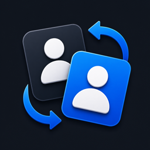

<p align="center">
  
</p>

<h1 align="center">Codex Accounts</h1>

<p align="center">
  Switch ChatGPT / Codex sessions from the avatar menu.<br>
  No restart. Separate login window. Auto-switch when quota runs out.
</p>

<p align="center">
  <a href="#english">English</a> ·
  <a href="#tiếng-việt">Tiếng Việt</a>
</p>

<p align="center">
  
  
  
  <a href="https://github.com/b-nnett/codex-plusplus"></a>
</p>

<p align="center">
  A <a href="https://github.com/b-nnett/codex-plusplus">Codex++</a> tweak ·
  <a href="https://github.com/LightHaru/codex-plusplus-accounts">LightHaru/codex-plusplus-accounts</a>
</p>

---

# English

One live ChatGPT / Codex session at a time. Codex Accounts swaps `auth.json` from the bottom-left avatar popup so you can hop accounts without quitting the app.

It is a **switcher**, not a quota pool. It does not proxy requests or add 100% + 100% into a shared 200% bar.

Based on [Easy Account Switcher](https://github.com/erknvl/codex-plusplus-account-switcher) by [erknvl](https://github.com/erknvl/). This fork moves the UI into the avatar menu, drops relaunch on switch, adds accounts without logging you out, and can fail over when the current account is empty.

## Features

- Switch accounts from the avatar popup. Window stays open.
- **Current** badge on the live account (name, not a generic "Primary").
- Per-account 5-hour and weekly remaining %, plus the next reset weekday / date / time.
- **Add another subscription** opens a separate OAuth window. The current session is left alone until you click the new account.
- **Auto-switch when quota runs out** (on by default): hops only when the live account's 5h **or** weekly remaining hits 0, and only to a saved account that still has remaining %. If every account is at 0%, it stays put.
- Sidebar **Accounts** page is still there if you want to delete a snapshot.

## vs Easy Account Switcher

| | Easy Account Switcher | Codex Accounts |
|---|---|---|
| Switch | Copy `auth.json`, **restart Codex** | Copy `auth.json`, **no restart** |
| UI | Accounts page in the sidebar | Avatar popup + sidebar fallback |
| Quota | Cached 5h / weekly | % on each row, auto-switch when the current one is empty |
| Add account | Logout + restart | Separate login window, live session kept |
| Store | Codex++ Tweak Store (`erknvl/...`) | This repo. **Do not Update the Store copy** |

## Install

Codex++ is required. Open Codex with the **Codex++ shortcut**, not the Microsoft Store icon.

1. Install [Codex++](https://github.com/b-nnett/codex-plusplus).
2. Clone this repo:

```bat
git clone https://github.com/LightHaru/codex-plusplus-accounts.git
```

3. Copy the folder to:

```
%APPDATA%\codex-plusplus\tweaks\codex-plusplus-accounts
```

The folder must contain `manifest.json` and `index.bundled.js`.

4. If **Easy Account Switcher** (`me.erkin.codex-plusplus-account-switcher`) is installed, turn it off or remove it. Both tweaks do the same job. A Store Update of that one will overwrite files and bring the old UI back.

5. Fully quit Codex++ (including the tray icon), then open the Codex++ shortcut again. Closing the avatar popup is not enough to load new tweak code.

**macOS**

```
~/Library/Application Support/codex-plusplus/tweaks/codex-plusplus-accounts
```

**Linux**

```
~/.config/codex-plusplus/tweaks/codex-plusplus-accounts
```

## Usage

1. Click the avatar in the bottom-left corner.
2. The popup lists saved accounts: usage remaining, per-account %, reset time, and a **Current** badge.
3. Click another account. Tokens in `auth.json` swap to that account. The window does not close.
4. Leave **Auto-switch when quota runs out** on if you want a hop when the live account hits 0% on 5h or weekly. It will not rotate through empty accounts.
5. **Add another subscription** opens a login window, saves a new snapshot, and does **not** log you out or restart. Click the new row when you actually want to switch.

Use the sidebar **Accounts** page (below Plugins) to delete a saved snapshot.

### Did the session actually change?

Yes. Switch copies `~/.codex/auth_accounts/<name>.json` over `~/.codex/auth.json` (access / refresh / id token). Codex requests after that pick up the new tokens.

The native Codex header name, avatar, and Usage % can stay stale because the app keeps identity in memory. Trust the popup list. Restart Codex only if you want the stock header to match.

### Quota

The % on each row is that account's own 5-hour / weekly cache. Numbers are not added into one shared pool. The total at the top of the list is only a quick glance.

Reset times use the machine's local timezone (example: `Thu, 20/08/2026, 18:06`).

### What this tweak does not do

- Does not pool several ChatGPT plans into one limit (no fake 360%).
- Does not MITM or proxy Codex traffic.
- Auto-switch changes the live session when the current account is exhausted. It does not split requests across accounts.

## Windows Store / Owl note

The real GUI binary is `ChatGPT.exe`, not `Codex.exe`. Calling `app.relaunch()` on the Store build often jumps to the unpatched Store app. This tweak does **not** relaunch on switch or Add account.

## Files on disk

| What | Windows path |
|---|---|
| Live session | `%USERPROFILE%\.codex\auth.json` |
| Per-account snapshots | `%USERPROFILE%\.codex\auth_accounts\<name>.json` |
| Current account marker | `%USERPROFILE%\.codex\current_account` |
| Quota cache | `%USERPROFILE%\.codex\auth_accounts_usage.json` |
| Auto-switch setting | `%USERPROFILE%\.codex\auth_accounts_autoswitch.json` |

## Build / test

```sh
npx esbuild index.js --bundle --platform=node --format=cjs --outfile=index.bundled.js --external:electron
node --test test/account-service.test.js test/profile-menu.test.js
node --check index.js
node --check index.bundled.js
```

`manifest.json` → `main`: `index.bundled.js`

Tweak id: `me.lightharu.codex-accounts`

## Credits

- [erknvl](https://github.com/erknvl/) — [Easy Account Switcher](https://github.com/erknvl/codex-plusplus-account-switcher) (`auth.json` snapshots, Accounts page, Codex++ hook)
- [Bennett / Codex++](https://github.com/b-nnett/codex-plusplus) — tweak runtime

---

# Tiếng Việt

Một session ChatGPT / Codex sống tại một thời điểm. Codex Accounts đổi `auth.json` ngay trong popup avatar góc dưới bên trái, **không cần tắt app**.

Đây là **switcher**, không phải bể quota. Không proxy request, không cộng 100% + 100% thành một thanh 200%.

Phát triển từ [Easy Account Switcher](https://github.com/erknvl/codex-plusplus-account-switcher) của [erknvl](https://github.com/erknvl/). Bản này đưa UI vào menu avatar, bỏ relaunch khi switch, thêm acc không logout, và tự chuyển khi acc đang dùng hết quota.

## Tính năng

- Đổi acc từ popup avatar. Cửa sổ không tắt.
- Badge **Current** trên acc đang dùng (tên thật, không ghi "Primary").
- % còn lại 5 giờ / weekly từng acc, kèm thứ / ngày / giờ reset.
- **Add another subscription** mở cửa sổ OAuth riêng. Session đang dùng giữ nguyên đến khi bấm acc mới.
- **Auto-switch when quota runs out** (mặc định bật): chỉ nhảy khi acc hiện tại hết 5h **hoặc** weekly (còn 0), và chỉ sang acc còn %. Cả list 0% thì đứng yên.
- Trang **Accounts** trên sidebar vẫn dùng được để xóa snapshot.

## Khác gì bản gốc?

| | Easy Account Switcher | Codex Accounts |
|---|---|---|
| Đổi acc | Copy `auth.json` rồi **restart Codex** | Copy `auth.json`, **không restart** |
| UI | Trang Accounts trên sidebar | Popup avatar + sidebar fallback |
| Quota | Cache 5h / weekly | Hiện % từng acc, auto-switch khi acc hiện tại hết |
| Add acc | Logout + restart | Cửa sổ login riêng, session đang dùng giữ nguyên |
| Store | Tweak Store (`erknvl/...`) | Repo này. **Đừng Update bản Store gốc** |

## Cài đặt

Cần [Codex++](https://github.com/b-nnett/codex-plusplus). Mở Codex bằng **shortcut Codex++**, không phải icon Microsoft Store.

1. Cài Codex++.
2. Clone repo:

```bat
git clone https://github.com/LightHaru/codex-plusplus-accounts.git
```

3. Copy nguyên folder vào:

```
%APPDATA%\codex-plusplus\tweaks\codex-plusplus-accounts
```

Cần có `manifest.json` và `index.bundled.js` trong folder đó.

4. Nếu đang cài **Easy Account Switcher** (`me.erkin.codex-plusplus-account-switcher`) thì tắt / gỡ. Hai tweak trùng chức năng. Store Update bản đó sẽ đè file và kéo UI cũ.

5. Đóng **hẳn** Codex++ (cả khay hệ thống), rồi mở lại shortcut Codex++. Chỉ đóng/mở popup avatar **không** đủ để nạp code mới.

**macOS**

```
~/Library/Application Support/codex-plusplus/tweaks/codex-plusplus-accounts
```

**Linux**

```
~/.config/codex-plusplus/tweaks/codex-plusplus-accounts
```

## Hướng dẫn dùng

1. Bấm avatar góc dưới bên trái.
2. List acc hiện trong popup: Usage remaining, % từng acc, giờ reset, badge **Current**.
3. Bấm acc khác: token trong `auth.json` đổi sang acc đó, cửa sổ không tắt.
4. Để **Auto-switch when quota runs out** bật nếu muốn tự hop khi acc đang dùng về 0% (5h hoặc weekly). Không xoay vòng các acc đã hết.
5. **Add another subscription** mở cửa sổ login, lưu snapshot acc mới, **không logout / không restart**. Bấm dòng acc mới khi muốn chuyển.

Trang **Accounts** trên sidebar (sau Plugins) dùng để xóa snapshot.

### Session có đổi thật không?

Có. Switch copy `~/.codex/auth_accounts/<tên>.json` đè lên `~/.codex/auth.json` (access / refresh / id token). Request Codex sau đó lấy token mới.

Tên, avatar và dòng Usage **gốc** của Codex có thể còn stale vì app giữ identity trong bộ nhớ. Nhìn list trong popup. Restart Codex chỉ khi muốn header gốc khớp luôn.

### Quota

% trên từng dòng là cache 5 giờ / weekly **của acc đó**, không cộng thành một bể chung. Số tổng trên đầu list chỉ để nhìn cho nhanh.

Giờ reset theo timezone máy (ví dụ `Th 5, 20/08/2026, 18:06`).

### Không làm gì

- Không pool nhiều gói ChatGPT thành một hạn mức (không cộng 360%).
- Không MITM / proxy request Codex.
- Auto-switch chỉ đổi session khi acc đang dùng đã hết quota, không chia từng request.

## Lưu ý Windows Store / Owl

App GUI thật là `ChatGPT.exe`, không phải `Codex.exe`. `app.relaunch()` trên bản Store hay nhảy sang app chưa patch. Tweak này **không** dùng `app.relaunch()` khi switch hay Add account.

## File lưu trên máy

| Việc | Đường dẫn Windows |
|---|---|
| Session đang sống | `%USERPROFILE%\.codex\auth.json` |
| Snapshot từng acc | `%USERPROFILE%\.codex\auth_accounts\<tên>.json` |
| Acc hiện tại | `%USERPROFILE%\.codex\current_account` |
| Cache quota | `%USERPROFILE%\.codex\auth_accounts_usage.json` |
| Auto-switch | `%USERPROFILE%\.codex\auth_accounts_autoswitch.json` |

## Build / test

```sh
npx esbuild index.js --bundle --platform=node --format=cjs --outfile=index.bundled.js --external:electron
node --test test/account-service.test.js test/profile-menu.test.js
node --check index.js
node --check index.bundled.js
```

`manifest.json` → `main`: `index.bundled.js`

Tweak id: `me.lightharu.codex-accounts`

## Cảm ơn

- [erknvl](https://github.com/erknvl/) — [Easy Account Switcher](https://github.com/erknvl/codex-plusplus-account-switcher) (snapshot `auth.json`, trang Accounts, móc vào Codex++)
- [Bennett / Codex++](https://github.com/b-nnett/codex-plusplus) — runtime load tweak
